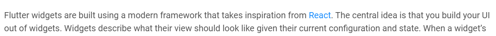
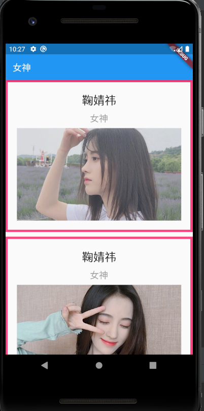
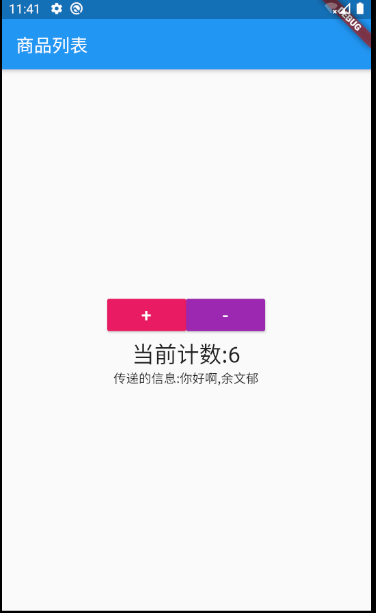
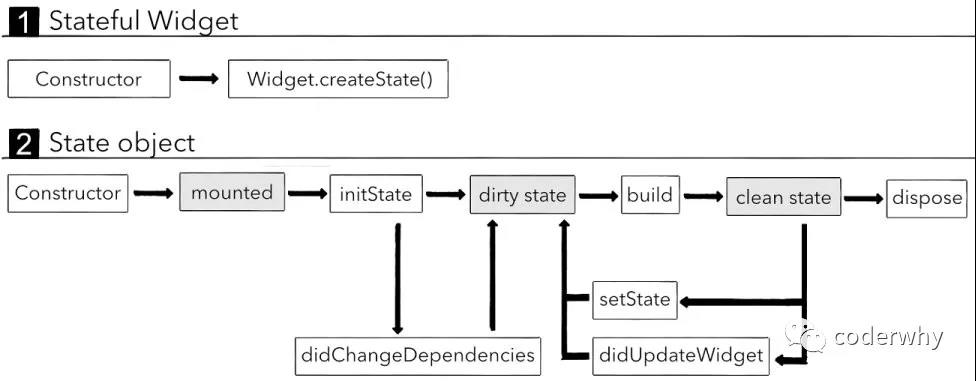

# 学习 Flutter 之 Widget 系列

Flutter 作为一个跨端 UI 框架，其实其组件化开发方式大量借鉴了 React 。官网中也提到了这一点



官网地址如下: https://flutter.dev/docs/development/ui/widgets-intro


## 一、StatelessWidget 篇


### 1. 对比 React 思想

开发过 React 的都知道，React 就是一种基于类的方式来构建 UI 界面的，Flutter亦是如此，React 中的 Component 是继承于 React.Component，代表一个组件，在 Flutter 中，组件的概念变成了 Widget，虽然名字不一样，含义是一样的，对比 React 中的有状态组件和无状态组件， Flutter中的组件概念变成了 StatelessWidget和StatefulWidget，其具体用法根据下面的 DEMO 来介绍


### 2. Flutter 开发思想

```dart
import 'package:flutter/material.dart';

void main() => runApp(MyApp());

class MyApp extends StatelessWidget {
  @override
  Widget build(BuildContext context) {
    return MaterialApp(
      home: YWYPage(),
    );
  }
}

class YWYPage extends StatelessWidget {
  @override
  Widget build(BuildContext context) {
    return Scaffold(
      appBar: AppBar(title: Text('女神')),
      body: YWYContent(),
    );
  }
}

class YWYContent extends StatelessWidget {
  @override
  Widget build(BuildContext context) {
    return ListView(
      children: <Widget>[
        YWYContentItem('鞠婧祎','女神','assets/images/jujingyi42.jpg'),
        SizedBox(height: 10,),
        YWYContentItem('鞠婧祎','女神','assets/images/jujingyi33.jpg'),
        SizedBox(height: 10,),
        YWYContentItem('鞠婧祎','女神','assets/images/jujingyi22.jpg'),
      ],
    );
  }
}

class YWYContentItem extends StatelessWidget {
  final String title;
  final String desc;
  final String imgURL;

  YWYContentItem(this.title, this.desc, this.imgURL);

  final style1 = TextStyle(fontSize: 25, color: Colors.black87);
  final style2 = TextStyle(fontSize: 20, color: Colors.grey);

  @override
  Widget build(BuildContext context) {
    return Container(
      padding: EdgeInsets.all(20),
      decoration: BoxDecoration(
        border: Border.all(
          width: 5,
          color: Colors.pinkAccent
        )
      ),
      child: Column(
        children: <Widget>[
          Text(title, style: style1,),
          SizedBox(height: 8),
          Text(desc, style: style2,),
          SizedBox(height: 8),
          Image.asset(imgURL)
        ],
      ),
    );
  }
}
```


### 3. 显示界面




### 4. 用法详解

> 1. runApp()是啥

首先回顾一下，main是dart的程序入口，Flutter基于dart开发，框架启动时会从**main.dart**文件的main函数开始执行，而runApp是Flutter运行的一个入口，从这个函数开始构建UI，我们可以去看看其源码中都干了什么

```dart
void runApp(Widget app) {  // 需要我们传入一个 Widget
  WidgetsFlutterBinding.ensureInitialized()
    ..scheduleAttachRootWidget(app)
    ..scheduleWarmUpFrame();
}
```

> 2. class MyApp extends StatelessWidget 是啥

回顾一下 React 开发方式，这就是一种基于类的方式构建UI的方式，先来看看源码

```dart
abstract class StatelessWidget extends Widget {
  @protected
  Widget build(BuildContext context);
}
```

我们可以看出 StatelessWidget 是一个抽象类，只能用子类来实例化，再看他有一个 build 方法，需要子类来重写，这就是构建UI的方法，类比 React 中 的 render 方法，对比如下:

```t
// Flutter
class MyWidget extends StatelessWidget {
  @Override
  Widget build(BuildContext context) {
    return ...
  }
}

// React
class MyComponent extends React.Component {
  render() {
    return ...
  }
}
```

> 3. MaterialApp是什么

MaterialApp是我们使用 Flutter开发中最常用的符合[Material Design](https://link.zhihu.com/?target=https%3A//material.io/)设计理念的入口Widget。你可以将它类比成为网页中的<html></html>，且它自带路由、主题色，<title>等功能。他有一个 home 的可选命名参数就是我们常用传入 Widget用作Page的

> 4. Scaffold是什么

就是构建页面的脚手架，可以设置 appBar，body，floatingActionButton， drawer等常用功能

> 5. ListView是什么

ListView是一个可滚动列表的 Widget，用于列表的构建，是一个多子组件，传入的参数是children，不是child，源码如下:

```dart
class ListView extends BoxScrollView
abstract class BoxScrollView extends ScrollView
abstract class ScrollView extends StatelessWidget
abstract class StatelessWidget extends Widget
    
@immutable
abstract class Widget extends DiagnosticableTree
```

> 6. StatelessWidget中的属性必须是final修饰的吗

是的，因为StatelessWidget继承自Widget，Widget有一个装饰器@immutable表明是不可变的，所以要用final，结论就是定义到Widget中的数据要使用 final 来修饰

> 7. TextStyle是什么

TextStyle是用来修饰文字样式的，我们可以把他们抽离出来用变量保存，同时注意，组件化开发的话，还可以吧Widget抽离到一个方法中返回或者抽离到另一个class中来单独构建，用于最终页面的组合

> 8. Container是啥

Container是一个容器 Widget，可以用来包装一些 Widget，同时可以设置一些样式，比如padding（也有一个Padding的Widget可以实现），decoration等等

> 9. Container中的padding属性

padding属性的类型是EdgeInsetsGeometry，但他是一个抽象类，不能实现，需要用到子类，他有一个子类是EdgeInsets，有一个all方法可以设置padding,当然也有其他的，可以去源码中看

```dart
const EdgeInsets.all(double value)
    : left = value,
      top = value,
      right = value,
      bottom = value;

const EdgeInsets.only({
    this.left = 0.0,
    this.top = 0.0,
    this.right = 0.0,
    this.bottom = 0.0,
  });
```

> 10. Container中的decoration属性

首先他的类型是Decoration，也是一个抽象类，我们要用他的子类BoxDecoration，可以用子类来设置一些样式

```dart
const BoxDecoration({
    this.color,
    this.image,
    this.border,  // BoxBorder类型（抽象类）,子类为Border，可以用这个子类来构建border，例如：Border.all()
    this.borderRadius,
    this.boxShadow,
    this.gradient,
    this.backgroundBlendMode,
    this.shape = BoxShape.rectangle,
  })
    
factory Border.all({
  Color color = const Color(0xFF000000),
  double width = 1.0,
  BorderStyle style = BorderStyle.solid,
})
```

> 11. Column是什么

Column是一个列Widget，是一个多子组件，参数是children

```dart
class Column extends Flex
class Flex extends MultiChildRenderObjectWidget  // 多子
```

> 12. SizedBox是什么

用来设置间隔的 Widget，在网页开发中我们可以用margin，但是 Flutter中没有margin这个东西，我们可以用这个 Widget来实现，可以设置垂直方向的，用height属性，或水平方向的，用width属性


## 二、StatefulWidget 篇

```dart
import 'package:flutter/material.dart';

main() => runApp(MyApp());

class MyApp extends StatelessWidget {
  @override
  Widget build(BuildContext context) {
    return MaterialApp(
      home: HYHomePage(),
    );
  }
}

class HYHomePage extends StatelessWidget {
  @override
  Widget build(BuildContext context) {
    return Scaffold(
      appBar: AppBar(
        title: Text("商品列表"),
      ),
      body: HYHomeContent("你好啊,李银河"),
    );
  }
}


// Widget是不加_: 暴露给别人使用
class HYHomeContent extends StatefulWidget {
  final String message;

  HYHomeContent(this.message);

  @override
  State<StatefulWidget> createState() {
    return _HYHomeContentState();
  }
}

/**
 * 为什么Flutter在设计的时候StatefulWidget的build方法放在State中
 *  1.build出来的Widget是需要依赖State中的变量(状态/数据)
 *  2.在Flutter的运行过程中:
 *    Widget是不断的销毁和创建的
 *    当我们自己的状态发生改变时, 并不希望重新状态一个新的State
 */
// State是加_: 状态这个类只是给Widget使用
class _HYHomeContentState extends State<HYHomeContent> {
  int _counter = 0;

  @override
  Widget build(BuildContext context) {
    return Center(
      child: Column(
        mainAxisAlignment: MainAxisAlignment.center,
        children: <Widget>[
          _getButtons(),
          Text("当前计数:$_counter", style: TextStyle(fontSize: 25),),
          Text("传递的信息:${widget.message}")
        ],
      ),
    );
  }

  Widget _getButtons() {
    return Row(
      mainAxisAlignment: MainAxisAlignment.center,
      children: <Widget>[
        RaisedButton(
          child: Text("+", style: TextStyle(fontSize: 20, color: Colors.white),),
          color: Colors.pink,
          onPressed: () {
            setState(() {
              _counter++;
            });
          },
        ),
        RaisedButton(
            child: Text("-", style: TextStyle(fontSize: 20, color: Colors.white),),
            color: Colors.purple,
            onPressed: () {
              setState(() {
                _counter--;
              });
            }
        ),
      ],
    );
  }
}
```




用法详解

> 1. 为什么 StatefulWidget 要用 2 个类来构建

由于 StatefulWidget 也是继承自 Widget 其属性不能改，所以要用一个 State 类来管理状态, State中的属性可以不是final修饰的

> 2. 如何在 State 类中拿到 StatefulWidget 中的属性

通过this.widget.xxx,当然了，dart中this可以省略，不过注意，使用字符串模板时要带上{},不能省略

> 3. Column和Row中的mainAxisAlignment是啥

就是flex布局中的主轴和交叉轴

> 4. RaisedButton是什么

就是一种按钮，可以设置样式，同时注意有一个必传参数onPressed，是一个函数

> 5. setState是什么

想一下React中的setState，就是通知框架在状态改变时更新界面的意思


## 三、生命周期



难点解释:

dirty state: 将它标记为dirty会等待下一次的重绘检查，强制调用build方法来构建我们的Widget；setState就是将值改为dirty们用于下一次build

clean state: 它表示当前build出来的Widget，下一次重绘检查时不需要重新build；一次build完成后其值就由dirty改为clean