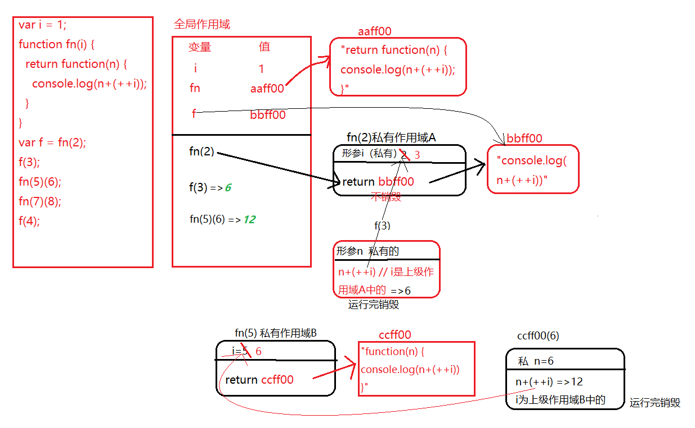

# 堆栈底层机制

浏览器执行JS

1. 内存中分配一块内存，用来执行JS
2. 分配主线程执行JS


## 闭包及堆栈内存释放

var、function声明会提前

全局作用域下声明一个变量，相当于给window设置了一个属性，全局变量和window有映射机制（但是ES6的let和 const 切断了全局变量和window的映射）

可用 ```in```关键字检测某个属性是否属于某个对象

```javascript
// 全局环境中
var a = 12;   // 用 var 关键字，这是在声明变量，而且与window存在映射机制
b = 13;       // 不用 var 关键字，本质就是window的属性，相当于 window.b = 13;
```

私有作用域中

带 var：私有变量，和外界无关

不带 var ：不是私有变量，会向上级作用域查找，一直找到window，这种查找机制就叫做作用域链，在作用域链查找过程中，如果找到window也没有，相当于给window设置了一个属性


------

### 堆栈函数机制及闭包内存释放问题

1. 创建函数

+ 开辟一个堆内存
+ 把函数体中的代码当字符串存进去
+ 把堆内存的地址赋值给函数名或变量名
+ 函数在哪创建，那他执行时所要找的上级作用域就是谁


2. 函数执行

+ 形成全新的作用域（执行上下文，私有栈内存），执行一次形成一个，多个之间不影响
+ 形参赋值和变量提升
+ 代码执行（把所属堆内存中的代码字符串拿出来以一行行执行）
+ 遇到一个变量，先看它是否为私有变量（形参和私有作用域中声明过的），是私有的就操作自己，不是私有的就想上级作用域查找，一直找到全局作用于为止
+ 私有变量和外界变量没有任何关系，可理解为被私有栈内存保护起来了，这个机制就是闭包保护机制





> arguments为函数实参列表，不管有没有形参或者是否传实参，这个arguments都存在，是一个类数组


# 元素自定义属性
元素自定义属性是向元素对应的堆内存添加一个属性:形如btn.index = i;
但是setAttribute是把属性信息写入标签结构上，并没有放入堆内存


