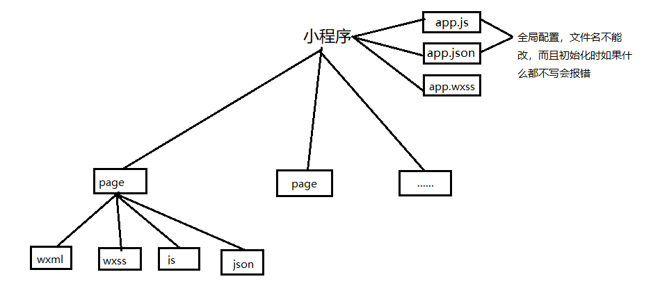
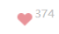
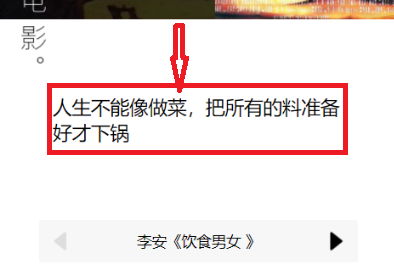
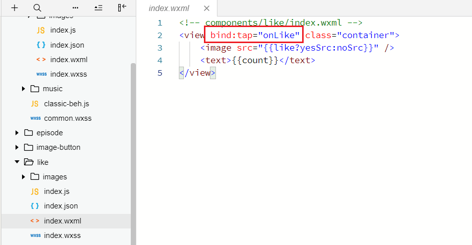
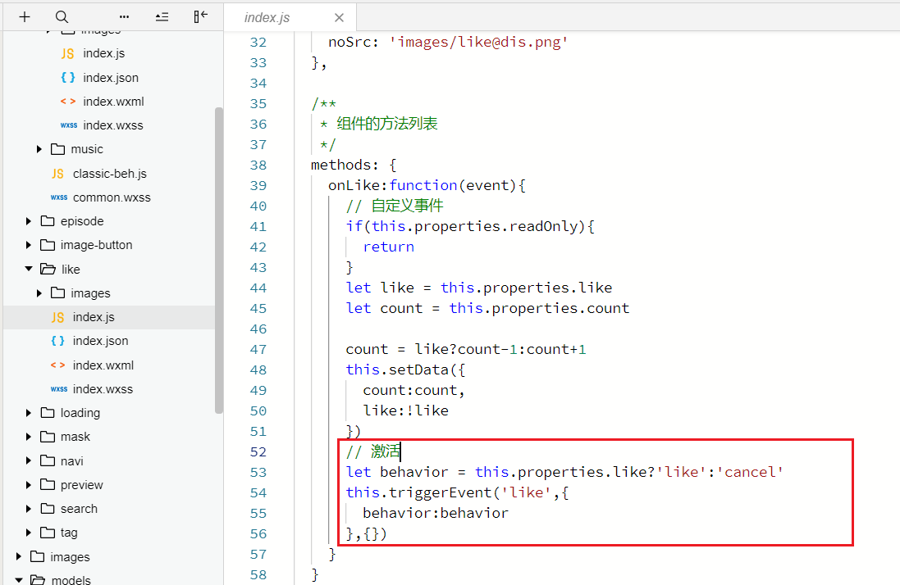
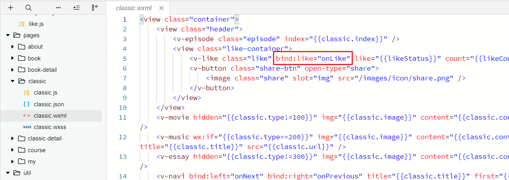
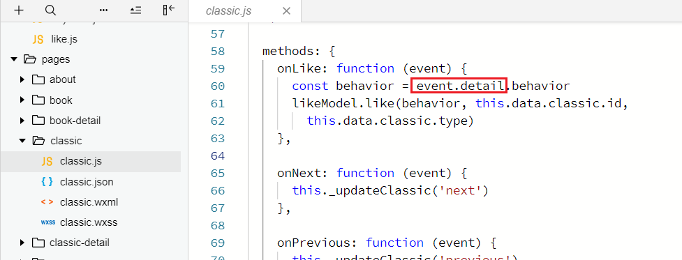

## 初识小程序
小程序的账号种类：个人、企业
AppID：用于使用微信平台的一些开放能力
小程序文件类型：wxml、wxss、js、json
小程序基本结构：



小程序根目录下的app.wxss用于定义全局样式，如：`page {font-size:20px;}`用于设置全局字号，这里的page标签时是小程序自动加入的

## 小程序组件化开发
1.定义组件：在项目根目录新建components目录，这是所有组件的目录，然后在components目录下新建文件夹作为一个单独的组件，例如like(目录名，不是组件名)，在like组件目录下用微信开发者工具的快捷新建component方式新建组件，每个组件下的文件命名为index.wxml/wxss/js/json
2.引用组件：在项目根目录的Pages目录下的某一个页面目录下的json文件中配置：指定组件名和路径即可，一个页面文件可以由多个组件组成

```json
{
    "usingComponents": {
        "v-like": "/components/like/index",
        ......
    }
}
```

3.使用组件：在对应页面的wxml中用标签形式使用就行了
4.组件只能继承少数全局样式（font、color,官方文档有），但是几乎所有全局样式都能被page页面继承
5.组件设计原则：组件之间不要留空白间距
bug解决示例：



数字上部被截断一部分：容器高度不够，设置padding即可
数字在垂直方向上便偏移不够：设置行高等于字号
因为文字上下都有空白间距，所以不是设置bottom偏移，而是设置行高消除间距
固定宽度还是自适应
考虑到数字是会变化的，所以要考虑container容器的宽度问题，如果一定要定宽，那么数字就不能太具体，如果是自适应，则把container的display从flex改为inline-flex即可

6. 项目型组件和通用型组件

> 图片管理
> 1.组件对应的各个目录，管理此组件用的图片
> 2.components目录，管理所有组件用到的图片
> 3.根目录的images文件夹放Page图片
> 1.小程序使用image标签时，必须设置宽高，否则小程序会设置image标签一个默认宽为300px，高为225px，影响正常显示，因此要设置image标签为图片原始尺寸。
> 2.小程序使用swiper标签写轮播时，为了使图片正常显示，要对swiper标签设置宽高，此时swiper-item会继承swiper的宽高，但是swiper-item中的图片的宽高不会继承，所以要对里面的文字也设置宽高

# ## 小程序尺寸单位与设计原则
2个尺寸单位：px、rpx（自适应单位）
rpx用法详解：如果一张图的原始尺寸为32*28，你想让图片的显示正常，如果用px单位，必须除以2，即16*14，这里的2倍换算设计2倍屏的问题，如果用rpx单位的话，直接写32rpx、28rpx即可，注意此换算关系是基于iphone6设计稿的

> iphone6设计稿在设计软件中的尺寸为750*1334（这个是物理像素)
>
> 如何适配：
> 以iphone6的物理像素750*1334为视觉稿进行设计，而在小程序中使用rpx单位，在iphone6中，1px=2物理像素，使用rpx，小程序会自动在不同分辨率下转换，而px是固定单位，不会转换，当然，并不是所有尺寸都适合用rpx，比如字体就适合用px单位
> 1px=2物理像素=2rpx

## 组件事件与事件处理

1. 注册事件：bind：tap="onLike"形式
2. js中定义事件处理函数

页面数据来源：
1. wxml
2. js -> wxml
3. server -> js -> wxml
数据绑定：{{ ... }}
数据更新：如果数据被绑定到了wxml中，必须用setData，对于page页面来说，只有data中的数据可以被使用，但是对于组件来说，properties中的数据也可以使用

## 组件的封闭性、开放性及粒度
封闭性：哪些数据应该被封装
开放性：哪些数据应该开放，即可以从外部对其进行设置
粒度：哪些该封装，那些不该封装
组件的properties属性（组件的js文件中）就是组件中开放出来的数据
写法：必须是js对象，目前只支持这3个配置，properties中的数据也可以写在{{}}中

```wxss
properties: {
    like:{
      type: Boolean,                    //类型，必填
      value: false,                     //默认值 ，选填
      observer: function() {            //值改变时触发的函数，选填

      } 

}
```

在methods方法列表中访问properties中的数据要用this.properties.XXX格式

Page的生命周期函数(不能改名)
1. onLoad：应用场景：发送请求拿数据
wx.request({}),参数为object，常用属性：url、method、data、header、success、fail
success （res）：成功收到服务返回时执行的回调函数，返回状态码不论是2XX还是4XX都会执行success函数
fail（err）：接口调用失败时执行的回调函数，网络中断会执行fail函数，可以理解为接口调用失败为网络中断
如果要接收一个异步函数调用的结果的话必须使用回调函数，异步操作时使用的回调函数，会剥夺函数return的能力，可以使用Promise解决这个问题
2. onShow
3. onReady
4. onHide
5. onUnload

http请求配置

```javascript
const config = {
    api_base_url: 'http://bl.7yue.pro/v1/',
    appkey: 'aihsuvbjkvnfhbvj'
}
export { config }
```

简单封装http请求
根目录新建工具类文件夹utils，在里面新建http.js

```javascript
import { config } from '../config.js';  //使用相对路径
class HTTP {
    request(params) {
        if(!params.method) {
            params.method = 'GET'
        }
        wx.request({
            url: config.api_base_url + params.url,
            method: params.method,
           data: params.data,
           header: {
               'content-type': 'application/json',
               'appkey': config.appkey
           },
           success: (res) => {
               let code = res.statusCode.toString();
               if(code.startWith('2')) {
                   //......
               } else {
                   // server 异常
               }
           }，
           fail: (err) => {
               // API调用失败
           }
        })
    }
}
```

movie组件细节



文字太长要换行，用width设置，但是如果文字很少，宽度被固定后因为文字没填满看起来就不居中，把width换成max-width就行了

## 点赞&取消功能
点赞和取消逻辑写在page页面中，但为了让页面监听到点击事件，需要在组件中激活一个事件，并携带数据通知page页面









*** 可以通过event.datail拿到传过来的数据

## data和properties
```javascript
data: {
    // 不能以这种方式指定默认值，因为Number和String会被解析成函数
    year: Number,
    month: String
    // 用这种方式是正确的
	year: 0,
	month: ''

}
```

data和properties打印的结果相同，因为这2个最终都指向一个对象，也就是说properties会和data对象合并，若properties中和data对象有属性值相同，properties会覆盖data中的属性，还有，千万不要在observer中修改自身属性值，可能会导致内存泄漏

## 关于用户体验
增大触碰区域：1. 设计图大一点   2. 自己写代码扩大区域

## Navi组件
navi组件控制电影组件的切换思路：在navi组件内部监听2个按钮的事件，用triggerEvent激活事件并在页面中监听

## Behavior
behaviors 是用于组件间代码共享的特性，类似于一些编程语言中的“mixins”或“traits”。
每个 behavior 可以包含一组属性、数据、生命周期函数和方法。组件引用它时，它的属性、数据和方法会被合并到组件中，生命周期函数也会在对应时机被调用。 每个组件可以引用多个 behavior ，behavior 也可以引用其他 behavior

1. 定义behavior

  ```javascript
  let Beh = Behavior({
   properties: {
       img: String,
       content: String
   }
  })
  export { Beh };
  ```

  

2. 在组件的js文件中引入，并在

  ```javascript
  import { Beh } from '../classic-beh.js';
  Component（{
   behaviors: [Beh]，   //数组形式，因为可以引入多个behavior
   ......
   可以通过'this.'的方式调用行为的方法
  }）
  ```

  

注意： behavior多继承与覆盖规则
属性相同，组件中的同名属性覆盖 behavior中的属性，后面的 behavior中的属性覆盖前面的，生命周期函数不会覆盖

## 期刊切换
业务代码，写在models文件夹下
思路：点击按钮发送请求获取前一期或后一期的数据，更新数据classic
缓存应用：
获取一起的期刊现在缓存中找，没有再发请求，并写入缓存
所有期刊在缓存中都有一个key，key的确定要能代表期刊吗，而且能代表是哪一期的期刊，然而缓存带来了很多新问题（加入缓存后对点赞状态更新的问题），所以要考虑哪些数据要被缓存（期刊数据），哪些不能被缓存（点赞状态和人数），因此在models/like.js定义一个获取点赞状态的函数

## ## 关于条件渲染
wx:if="{{}}"
hidden="{{}}"   //对自定义组件无效
那么怎么让自定义组件支持呢？在组件的js文件中定义properties
```javascript
properties: {
    hidden:Boolean
}
```

wx:if="{{}}"
hidden="{{}}"   //对自定义组件无效
那么怎么让自定义组件支持呢？在组件的js文件中定义properties

再在组件的wxml中写hidden="{{hidden}}",这样就可以在外部的页面中通过属性传入了

## 关于wx:for
wx:for="{{books}}"中的每一项用item标识，这是小程序内定的，不能随便改名，如果要改名，用wx:for-item="itemName"即可，另外，关于wx:key=""的值，如果遍历的是对象，可用其中的一个属性，如id，但不用填wx:key="item.id",直接写wx:key="id"就行，如果遍历的是数字或字符串，写wx:key="*this"

## 关于flex-wrap
flex-wrap特征是尽可能在一行放多个元素，实在放不下再换行，可以用width或左右的padding进行调整

## @import
因为movie组件和essay组件样式一样，复制代码看起来没意思，所以用到@import复用公共样式

## ## 新版音乐播放对象
wx.getBackgroundAudioManager()
常用属性：
paused：表示是否暂停或停止
src：数据源，默认为空，设置了新的src时音乐会自动播放
title：标题
常用方法
play,pause.stop
事件监听函数
onPlay
onPause
onStop
onEnded
如何播放和停止音乐？
```javascript
//创建播放对象
const mBgm = wx.getBackgroundAudioManager();
//指定src就可以播放了
mBgm.src= "dkiuhfbn.mp3";
//暂停
mBgm.pause()
```

wx.getBackgroundAudioManager()
常用属性：
paused：表示是否暂停或停止
src：数据源，默认为空，设置了新的src时音乐会自动播放
title：标题
常用方法
play,pause.stop
事件监听函数
onPlay
onPause
onStop
onEnded
如何播放和停止音乐？

## 组件间通信
问题1：如何在切换期刊时停止当前播放的音乐？

1. 2个平行组件间不太好直接传递数据，但是可以通过页面来做转发，间接传递数据

2. 监听到组件消失的事件来停止播放，组件消失的生命周期函数为detached，示例：

  ```javascript
  detached:function(event) {   //但如果你是用hidden方式去隐藏组件的话，detached是不会触发的，因此要换成微信wx:if
   mBgm.stop()
  }
  ```

  

这里解释下为什么需要频繁切换的情况下用hidden，因为每次改变wx:if的值，wx:if控制的组件会执行一次完整的生命周期
问题2：如何让音乐一直是播放状态，并且切换期刊时每个音乐期刊的状态都是正确的？
每次切换到新的音乐期刊时做一次检测，当前播放的音乐是不是当前音乐期刊显示的音乐，只要相等，小图标应该显示暂停的图标，否则显示播放的图标。那么在哪里编写检测代码呢？用组件生命周期函数（用attached），这个attached也是只能用wx:if来触发

```javascript
 // components/classic/music/index.js
    attached(event) {
    // 跳转页面 当前 切换，不用加method._recoverStatus()
        this._recoverStatus()
        this._monitorSwitch()
    },
    //用来切换期刊时保持每个音乐期刊的状态正常
    _recoverStatus: function () {
      if (mMgr.paused) {
        this.setData({
          playing: false
        })
        return
      }
      if (mMgr.src == this.properties.src) {
        this.setData({
          playing: true
        })
      }
    },
        // 通过音乐总控开关来控制小图标
    _monitorSwitch: function () {
      mMgr.onPlay(() => {
        this._recoverStatus()
      })
      mMgr.onPause(() => {
        this._recoverStatus()
      })
      mMgr.onStop(() => {    //关掉音乐总控开关
        this._recoverStatus()
      })
      mMgr.onEnded(() => {   //让音乐自然播放完成，这个容易忽视
        this._recoverStatus()
      })
    }
```


## ## Promise本质与用法
Promise是对象，不是函数，是对象说明能保存状态
Promise有3种状态：
pending（进行中，即异步操作在进行）
fullfilled（异步操作成功）
rejected（异步操作失败）
基本步骤：
1.new一个Promise（new了之后的状态就是pending）
2.异步代码写在Promise函数中
示例：
```javascript
const promise = new Promise((resolve,reject) => {
    wx.getSystemInfo({
        success: res => {
            resolve(res);  //把状态从进行中改为已成功，当状态改变之后就不能变了
        },
        fail: err => {
            reject(err);   //把状态从进行中改为已失败，当状态改变之后就不能变了
        }
    })
})
```

Promise是对象，不是函数，是对象说明能保存状态
Promise有3种状态：
pending（进行中，即异步操作在进行）
fullfilled（异步操作成功）
rejected（异步操作失败）
基本步骤：
1.new一个Promise（new了之后的状态就是pending）
2.异步代码写在Promise函数中
示例：

3.获取结果
//then方法接收2个回调，一个成功时的回调，一个失败时的回调，注意顺序，成功的回调在前

```javascript
promise.then(
    res => console.log(res),
    err => console.log(err)
)
```

Promise精髓：以一个对象的方式保存了一个异步操作的结果，可以赋值给一个变量，当你任何时候想要异步操作的结果，都可以用promise.then()来获取

## 书的详情页展示
如何点击一本书，展示详情信息？
点击一本书的组件，需要把自己的id号从组件中传入book页面，再将id号传入book-detail中以展示相应的详情信息
因为book组件知道自己的id号，所以把页面跳转的wx:navigateTo直接写在book组件中即可，带上相应的id号，在book-detail页面中onLoad函数通过options拿到就行了。
对一个页面传参数，所有参数都包含在onLoad函数的options参数中

## 小程序的3种编译模式
普通编译：打开app.json中的第一个页面
自定义编译：修改启动页面
通过二维码编译

## Margin问题
如果不用flex布局，自动换行的元素设置margin-bottom是无效的

## ## slot使用
在组件的wxml中可以包含 slot 节点，用于承载组件使用者提供的wxml结构。
默认情况下，一个组件的wxml中只能有一个slot。需要使用多slot时，可以在组件js中声明启用。
```javascript
Component({
  options: {
    multipleSlots: true // 在组件定义时的选项中启用多slot支持
  },
  properties: { /* ... */ },
  methods: { /* ... */ }
})
```

在组件的wxml中可以包含 slot 节点，用于承载组件使用者提供的wxml结构。
默认情况下，一个组件的wxml中只能有一个slot。需要使用多slot时，可以在组件js中声明启用。

## ## 自定义组件样式问题
自定义组件是一组内置组件的集合，你对自定义组件设置样式是不知道对其中的那个内置组件设置样式，例如，你可以这样：
```css
.comment-container > v-tag:nth-child(1) > view {
  color:red;         //你还可以用nth-child(odd)奇数||nth-child(even)偶数
}
```

自定义组件是一组内置组件的集合，你对自定义组件设置样式是不知道对其中的那个内置组件设置样式，例如，你可以这样：

但是这样修改了组件本身，违反了组件封装原则，所以对于自定义组件样式问题要用外部样式处理。
使用步骤：

1. 组件的js文件中写上这些

  ```javascript
  /* 组件 custom-component.js */
  Component({
   externalClasses: ['my-class']
  })
  ```

  

2.并在组件的wxml中加上类名

```html
<!-- 组件 custom-component.wxml -->
<custom-component class="my-class">这段文本的颜色由组件外的 class 决定</custom-component>
```


3. 在page页面通过属性传入

  ```html
  <!-- 页面的 WXML -->
  <custom-component my-class="red-text" />
  <custom-component my-class="large-text" />
  <!-- 以下写法需要基础库版本 2.7.1 以上 -->
  <custom-component my-class="red-text large-text" />
  ```

  

4. 在page页面的wxss中定义样式

  ```css
  .red-text {
   color: red;
  }
  .large-text {
   font-size: 1.5em;
  }
  ```

  

但是，外部样式不一定会覆盖普通样式，这是可以通过!important解决

## 关于服务器返回的数据
network面板的response才是服务器返回的原始数据

wxs
WXS（WeiXin Script）是小程序的一套脚本语言，结合 WXML，可以构建出页面的结构。
不同于js，只是借鉴了js，语法形式像而已，比如不能用const定义
示例：过滤服务器的数据

```javascript
//filter.wxs
var format = function(text) {
    //format运行2次是因为：book.summary是setData的结果，setData为更新数据，
    //book初始化的时候运行了一次，但此时是没有值的
    //服务器数据返回并用setData更新book数据又运行了一次format
    //所以要判断summary有没有值
    if(!text) {   //处理format运行2次的问题
        return
    }
    var reg = getRegExp('\\\\n',g);
    return text.replace(reg,'\nnbsp;nbsp;') //段落换行并处理每行文本缩进
    //段首缩进要用text-indent单独设置58rpx;
}
module.export = {
    format
}
```

在wxml中写wxs

```javascript
<wxs module='util'>
    var format = function() {
    }
    //也要导出,这里不要忘了
    module.export = {
        format
    }
</wxs>
```


在wxml中引入

```html
<wxs src="relative path" module='util'>
```

使用方法

```html
<text>{{util.format(book.summary)}}</text>
```

并行请求与串行请求（处理loading的加载图）

```javascript
Promise.all([]):多个promise实力合并成一个并返回新的promise
Promise.all([detail, comments, likeStatus])  //3个请求全部完成才执行回调
.then(res => {
    this.setData() {
    ...
    }
    wx.hideLoading();
})

Promise.race([]):只要有一个请求完成就执行回调
```

搜索组件（高阶组件）
自定义组件的models目录探讨，图片也类似

+ 组件目录下

+ components目录下

+ 根目录

组件中也可以引入组件
监听页面是否滑到底部：

1. scroll-view标签

2. Page的onReachBottom事件（只能在Page页面中用，不能在组件中用）

3. 监听onReachBottom事件，并发送一个消息（属性传递）给search组件就可以加载更多数据了，为了使每次触底都能执行属性的observer函数，需要每次传递的属性值不同，所以要用传递随机字符串来触发observer函数

## 加载更多数据

1. 加载更多数据的难点---数据要从哪里开始继续加载？确定start？
其实只需从data数据定义区的dataArray的长度处继续加载就行了，比如服务器一次返回20条数据，dataArray的长度为20，那么第二次从20处继续加载就行了，第三次从40处加载就行了，然后把加载来的数据与原来的数组合并就行了
注意：要判断加载的查询字符串q不为空才能加载
2. 使用锁解决重复加载问题
当用户操作过快，会同时发送多个请求，就会产生重复加载问题，只要设定一次只发一个请求即可
利用锁这个概念即可：锁就是当正在发送一个请求（加载更多或者说显示loading）时，锁起来，不要在发第二个请求，其实锁就是一个标识是否正在加载的变量（loading）而已，当loading为真时，说明正在加载数据，这是不要在发送第二个请求了，直接return，再加载完一次数据后再解锁loading=false
3. 判断是否还有更多数据
dataArray的长度等于服务器返回数据中的total值
一次请求返回的数据dataArray是否为空（不准确，因为如果网络问题，请求失败，返回了total为0，此时不能认为没有数据了）
4. 每次onConfirm搜索时清空上次搜索的dataArray，防治数据重复，同时重置total
5. 避免死锁
Bug复现：断网后恢复网络时，无法加载更多数据了
解决：在请求成功和失败时都要解锁，而不能只在请求成功时解锁

## 微信授权

1. 此方法不用授权就可以显示用户头像

  ```html
  <open-data type="userAvatarUrl"></open-data>
  ```

  

旧版授权方法：wx.getUserInfo()
新版：用button标签，让用户自己点，button可以指定open-type和bindgetuserinfo="getUserInfo"（用户点击该按钮时，会返回获取到的用户信息，回调的detail数据与wx.getUserInfo返回的一致，open-type="getUserInfo"时有效），此时就可以在js中通过getUserInfo获取用户信息
eg：

```javascript
getUserInfo(event) {
    console.log(event.detail)
}
```

授权之前要先判断用户是否已经授权了

```javascript
wx.getSetting({                   //判断用户是否授权
    success: data => {
        if(data.authsetting['scope.userInfo]) {  //为true表示已授权
            wx.getUserInfo({  //此方法能获得用户信息，但是只有在用户授权之后才能得到
                success: data => {
                }
            })
        } else {

        }
    }
})
```

## 小程序跳转
要从一个小程序跳转到另一个小程序，那么这2个小程序必须关联同一个公众号，不然无法跳转
wx.navigateTo(Object object)
保留当前页面，跳转到应用内的某个页面。但是不能跳到 tabbar 页面。使用 wx.navigateBack 可以返回到原页面。小程序中页面栈最多十层。
navigator标签用于小程序之间的跳转

## 关于npm
小程序的开发者工具是看不到node_module包文件夹的