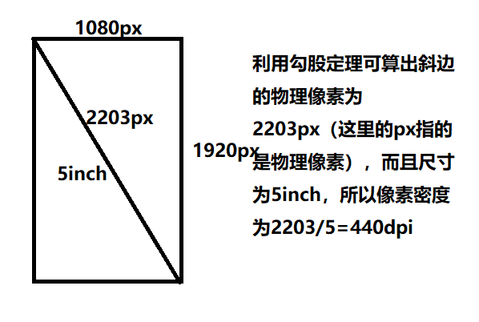
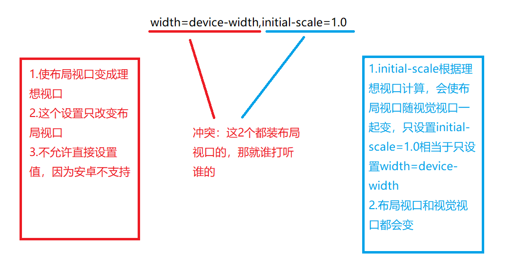

## 移动端教程摘录

1. 一些屏幕的基本认识

  + 高清屏和普通屏相比，相同区域物理像素点数中，高清屏是普通屏的4倍
  + 像素密度（PPI）：每英寸可显示的像素点数量

  

2.几个像素的认识
物理像素：设备呈像最小单位
CSS像素：浏览器中最小单位
位图像素：图像最小单位

CSS像素占据几个物理像素取决于屏幕特性（是否Retina，即像素比）和用户缩放行为
独立设备像素：可认为是计算机坐标系统中的一个点，这个点代表一个可以由程序使用的虚拟像素（比如CSS像素），然后由相关系统转换为物理像素
位图像素：栅格图像最小数据单元
1个位图像素对应于一个物理像素，图片才清晰
1个位图像素对应于多个物理像素，图片失真
1个位图像素对应于少于1个物理像素，图片锐化
像素比：物理像素/设备独立像素
当在meta标签中写上width=device-width，使CSS像素与设备独立像素连接起来，即CSS像素=设备独立像素

3.几个视口认识
布局视口
视觉视口
理想视口：包含的CSS像素的个数等于独立设备像素的值（布局视口=视觉视口）
物理像素与CSS像素1:1时，布局视口远远大于设备宽度（分辨率）
从物理像素出发，视觉视口包含物理像素个数永远等于设备的分辨率（屏幕中的所有内容是完全可以看到的）
从CSS像素角度出发，我们永远准确判断视觉视口的尺寸，因为视觉视口包含的CSS像素的个数跟用户的缩放行为有关

4.移动端获取视口信息
布局视口：document.documentElement.clientWidth(不包括滚动条)
视觉视口：window.innerWidth(浏览器视口宽度，包括垂直滚动条)
screen.width  //有兼容问题，因为可能代表2种值：理想视口尺寸和设备像素尺寸，所以不要用这个

5.操作
放大CSS像素面积，一个CSS像素面积变大。区域内CSS像素个数变少，视觉视口尺寸变小
缩小与放大情况相反就行
PC端：用户缩放影响视口尺寸
移动端：用户缩放影响视觉视口尺寸
但是：系统缩放（initial-scale=1.0)）是参照理想视口进行缩放，改的是布局视口和视觉视口
完美视口：当布局视口元素太大，超过视觉视口，有滚动条



6.rem适配
适配：实现页面在不同设备上等比
em:相对于自身的font-size
rem：相对于html标签的font-size
chrome下字体默认大小为16px，最小大小为12px
eg：默认16px=100% -> 10px=62.5%;
那么你要12px，则em=12/10=1.2em
body {font-size:62.5%},设置成这个是为了方便计算
//改变一个元素在不同设备上占据的css像素个数 根标签font-size=布局视口的1/16

```javascript
(function(){
    var styleNode = document.createElement('style');
    var w = document.documentElement.clientWidth/16;
    styleNode.innnerHTML = 'html{font-size}'+w+'px!important';
    document.head.appendChild(styleNode);
}
)();
```

适配原理：改变了一个元素在不同设备上占据的CSS像素个数
优点：没破坏完美视口
缺点：px到rem转换复杂

7.viewport适配
//改变一个css像素和物理像素的比例

```javascript
(functions(){
 var targetW = 640; //定义设计图宽度
 var scale = document.documentElement.clientWidth/targetW;
 var meta = document.querySelector('mate[name="viewport"]');
 meta.content = 'initail-scale='+scale+".minimum-scale="+scale+",maximun-scale="+scale+"user-scaleable=no";
docuement.head.appengChild(meta);
})();
```

适配原理：改变一个CSS像素和物理像素的比，每个元素在不同设备上占据的css像素的个数是一样的，但CSS像素和物理像素比例是不一样的，等比的
优点：所量及所得
缺点：没使用完美视口

移动端布局，为了适配各种大屏手机，目前最好用的方案莫过于使用相对单位rem。
基于rem的原理，我们要做的就是: 针对不同手机屏幕尺寸和dpr动态的改变根节点html的font-size大小(基准值)。
这里我们提取了一个公式(rem表示基准值)
`rem = document.documentElement.clientWidth * dpr / 10`

说明：
乘以dpr，是因为页面有可能为了实现1px border页面会缩放(scale) 1/dpr 倍(如果没有，dpr=1),。
除以10，是为了取整，方便计算(理论上可以是任何值)
所以就像下面这样，html的font-size可能会：
`iphone3gs: 320px / 10 = 32px`
`iphone4/5: 320px * 2 / 10 = 64px`
`iphone6: 375px * 2 / 10 = 75px`

8.百分比适配、流体（flex）+固定

9. 1像素边框问题
  来源：设计师想要的是1px的物理像素，但是移动端有dpr（设备像素比）这个东西，你写的1px是css像素，不一定等于1px的物理像素
  之前主流
  //淘宝做法：viewport+rem+js，动态修改页面缩放比，实现1像素的显示，设置rem根元素的大小
  //之前主流的做法

  ```javascript
  (function () {
   var dpr = window.devicePixelRadio || 1;
   var style = document.createElement("style");
   var w = document.documentElement.clientWidth * dpr /16;
   style.innerHTML = "html {font-size:}" + w + "px!important";
   document.head.appendChild(style);
   var scale = 1/dpr;
   var meta = document.querySelector("meta[name='viewport']");
   meta.content = "width=device-width,initial-scale=" + scale;
  })()
  ```

  方法总结：1.rem+系统缩放
  1)主题适配用rem，并放大rem的基值
  2)再通过系统缩放，缩回dpr倍：initial-scale=1/dpr
  2.响应式+变换缩放

  方法总结：1.rem+系统缩放
  1)主题适配用rem，并放大rem的基值
  2)再通过系统缩放，缩回dpr倍：initial-scale=1/dpr
  2.响应式+变换缩放

//现在的做法，利用像素比调整缩放

```css
@media only screen and (-webkit-device-pixel-ratio:2) {
    #test {
        transform: scaleY(.5);
    }
}
@media only screen and (-webkit-device-pixel-ratio:3) {
    #test {
        transform: scaleY(.3333333333);
    }
}
```

10.IE6最小高度问题

```html
<body>
    <div></div>
</body>
<style>
    div {
        width: 10px;
        height: 10px;  //在IE6下高度不是10px，而是大于10px，IE6一元素height最小是19px
    }
</style>
```


//解决最小高度问题方法
//父元素设置font-size：0


11.移动端事件（触屏、指针）
一些坑解释：querySelectorAll:获取静态列表，dom变了以后，整个系统会坏掉，就是你选了类名为list的div后，若下面操作又加了一个，不会记住这个dom操作，但是getElementByClassName可以记住，因此dom结构变了之后，用querySelectorAll这个方法的话要重新获取一次

事件：
touchstart
touchmove     //不可能单独触发
touchend
mousestart
mousemove   //可以单独触发
mouseend

用法：

```javascript
item.addEventListener("touchstart",function(ev){
    ev = ev || event;
    ev.preventDefault();  //阻止默认事件，比如长按选中
})
```

全面禁止事件默认行为：并不是所有事件默认行为都能被取消，要看e.cancelable的值，测试能否被取消时用真机调试
移动端全部禁止默认事件，想开放哪个就单独取消冒泡

```javascript
document.addEventListener("touchstart",function(ev){
    ev = ev || event;
    var item = document.querySelector(".item");
    console.log(ev.cancelable);
    item.innerHTML = ev.cancelable;
    ev.preventDefault();  //阻止默认事件，比如长按选中
})
```

pc端阻止右键菜单行为：

```html
<div id="wrap">
<div></div>
</div>
<script>
    document.oncontextmenu = function() {  //空白处不弹出
        return false;
    }
    var wrap = document.querySelector("#wrap");
    wrap.oncontextmenu = function() {  //wrap区域弹出
        ev = ev || event;
        ev.stopPropagation();
    }
    //可以自定义
    document.oncontextmenu = function() {
        ev = ev || event;
        var x = ev.clientX;
        var y = ev.clientY;
        var wrap = document.querySelector("#wrap");
        wrap.style.display = "block";
        wrap.style.left = x + "px";
        wrap.style.top = y + "px";
        return false;
    }
    document.onclick = function() {
        var wrap = document.querySelector("#wrap");
        wrap.style.display = "none";
    }
</script>
```

 pc端事件可在移动端触发，但有300ms延迟，移动端事件无延迟

12.移动端要做的事
1）meta标签
2）全面阻止默认行为，有隐患：滚动条失效，自定义滚动条
3）一个适配方案

```javascript
document.addEventListener("touchstart",function(ev){
    ev = ev || event;
    ev.preventDefault();  //阻止默认事件，比如长按选中
})
;(function(){
    var styleNode = document.createElement('style');
    var w = document.documentElement.clientWidth/16;
    styleNode.innnerHTML = 'html{font-size}'+w+'px!important';
    document.head.appendChild(styleNode);
}
)();
```

移动端a标签跳转，解决误触

```javascript
document.addEventListener("touchstart",function(ev){
    ev = ev || event;
    ev.preventDefault();  //阻止默认事件，比如长按选中
})
var a = document.querySelectorAll("a");
for (var i=0;i<a.length;i++) {
    a[i].addEventListener("touchstart",function() {
        this.isMoved = false;
    })
    a[i].addEventListener("touchmove",function() {
        this.isMoved = true;
    })
    a[i].addEventListener("touchend",function() {
        if (!this.isMoved) {
            location.href = this.href;
        }
    })
}
```


TouchEvent事件对象
属性：
changeTouches：触发当前事件的手指列表
targetTouches：触发当前事件时元素上的手指列表
touches：触发当前事件时屏幕上的手指列表

changedTouches：TouchList
    0：Touch
    clientX:
    clientY:
    pageX:
    pageY:
    screenX:
    screenY:
    ....


移动端一些问题
1.禁止电话邮箱
```html
<meta name="format-detection" content="telephone=no,email=no"/>
```

但如果指定号码可以相应的话，这么做：

```html
<a href="tel:110">110</a>
<a href="mailto:1622875676@qq.com">1622875676@qq.com</a></a>
```

2.a标签背景高亮

```css
a {
	-webkit-tap-highlight-color: rgba(0,0,0,0);
}
```

3.按钮圆角圆的太过分了

```css
input {
    width: 50px;
    height: 50px;
    border-radius:5px;  //移动端圆角推荐用px
    -webkit-appearance:none;
}
```

4.font-boosting:浏览器以为字太小，自动给你变大

```css
p{
    font-size:24px;   //手机上可能是49.9px
    max-height：9999999px;   //解决方案
}
```

5.移动端能写高度尽量写高度，避免font-boosting和重绘重排
6.

```css
input::-webkit-input-placeholder {
	color:black;
}
```

7.移动端1px触发一次touchmove